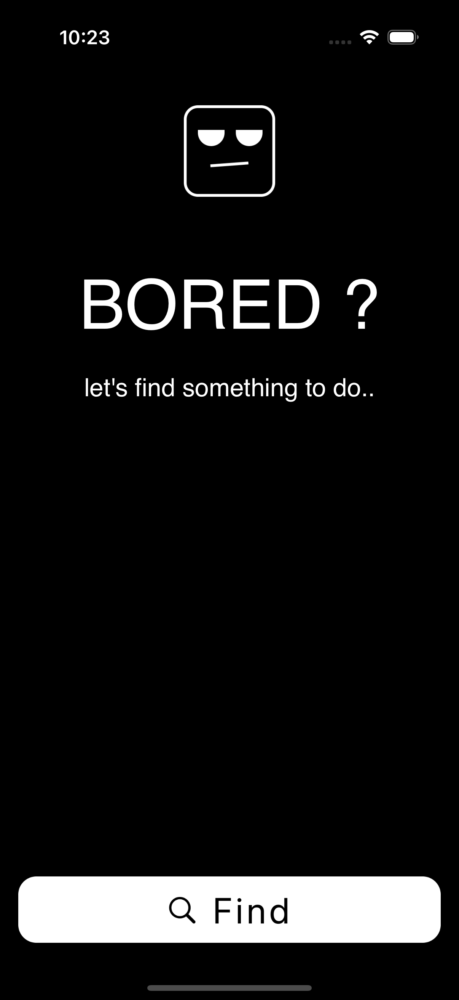

<h1 align = "center">Boredomo</h1>

## About
Boredomo is an application that inspires engagement at any moment of boredom, bringing with it fun activities and exciting tasks to entertain.

## Screenshot



## Installation

Since I am not currently enrolled in the Apple Developer Program, I am unable to publish the app on the App Store or TestFlight. To test the app, you will need to clone the project and run it locally using Xcode on a Mac. Here's how you can do it:

1. Clone the repository:

   ```sh
   git clone git@github.com:ajmalpoovanath/Boredomo.git

   ```

2. Open the project in Xcode:

   ```sh
   cd Boredomo
   open Boredomo.xcodeproj

   ```

3. Build and run the app on the iOS Simulator or your connected iOS device.
